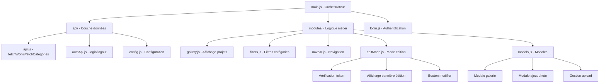
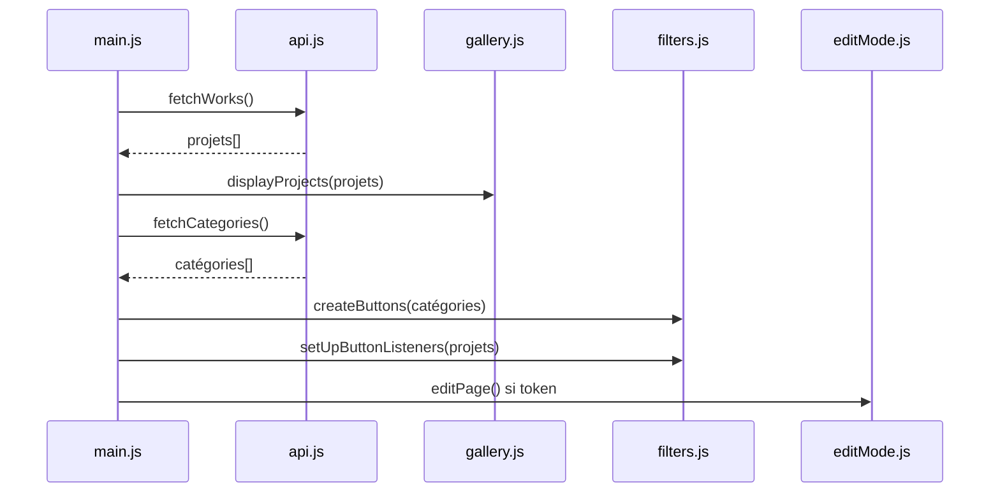

# Portfolio Architecte Sophie Bluel

Code du projet 6 d'intégrateur web - OpenClassrooms.

## 📁 Architecture Frontend

```
FrontEnd/
├── 📄 pages/                      # Pages HTML
│   ├── HomePage.html             # Page d'accueil avec portfolio
│   └── Login.html                # Page de connexion admin
│
├── 🎨 css/                        # Styles CSS modulaires
│   ├── Global.css                # Styles globaux et variables
│   ├── Navbar.css                # Navigation principale
│   ├── Introduction.css          # Section présentation
│   ├── Gallery.css               # Galerie de projets
│   ├── Contact.css               # Formulaire de contact
│   ├── Footer.css                # Pied de page
│   ├── Login.css                 # Styles page connexion
│   ├── HomePageEdit.css          # Styles mode édition
│   └── Modals.css                # Styles des modales
│
├── 🖼️ assets/                     # Ressources statiques
│   ├── images/                   # Images du portfolio
│   │   ├── sophie-bluel.png
│   │   ├── abajour-tahina.png
│   │   └── ... (autres projets)
│   └── icons/                    # Icônes
│       ├── instagram.png
│       └── add-photo.png
│
└── ⚙️ js/                         # Logique JavaScript modulaire
    ├── 📋 main.js                # Orchestrateur principal
    ├── 🔐 login.js               # Gestion authentification
    │
    ├── 🌐 api/                   # Couche d'accès aux données
    │   ├── api.js                # Appels API génériques
    │   │   ├── fetchWorks()      # Récupération projets
    │   │   └── fetchCategories() # Récupération catégories
    │   ├── authApi.js            # API authentification
    │   │   ├── login()           # Connexion utilisateur
    │   │   ├── logout()          # Déconnexion
    │   │   └── saveAuth()        # Sauvegarde token
    │   └── config.js             # Configuration API
    │
    └── 📦 modules/               # Modules métier
        ├── 🖼️ gallery.js         # Affichage galerie
        │   └── displayProjects() # Rendu des projets
        │
        ├── 🔘 filters.js         # Système de filtrage
        │   ├── createButtons()   # Création boutons filtres
        │   └── setUpButtonListeners() # Gestion clics
        │
        ├── 🧭 navbar.js          # Navigation
        │   └── clickNavbarLinks() # Gestion liens actifs
        │
        ├── ✏️ editMode.js        # Mode édition administrateur
        │   ├── editPage()        # Activation mode édition
        │   ├── displayBanner()   # Bannière "Mode édition"
        │   ├── updateNavbar()    # Login → Logout
        │   ├── setupEditButton() # Bouton "Modifier"
        │   └── hideFilterButtons() # Cache filtres
        │
        └── 🪟 modals.js          # Gestion des modales
            ├── loadModalGallery() # Modale galerie
            ├── loadModalAddPhoto() # Modale ajout photo
            ├── deleteProjectFromAPI() # Suppression projet
            └── refreshAllProjects() # Mise à jour galerie
```

## 🏗️ Architecture JavaScript

### Principe d'organisation

L'application suit une **architecture modulaire** avec séparation claire des responsabilités :



### Flux d'initialisation



## 🚀 Installation et lancement

### Prérequis

- Un éditeur de code (VSCode recommandé)
- Extension Live Server (pour le frontend)

### Frontend

1. **Ouvrir le dossier FrontEnd**

   ```bash
   cd FrontEnd
   ```

2. **Lancer avec Live Server**

   - Clic droit sur `pages/HomePage.html`
   - "Open with Live Server"

   L'application s'ouvre sur `http://localhost:5500`

## 🔑 Authentification

**Compte administrateur :**

- Email : `sophie.bluel@test.tld`
- Mot de passe : `S0phie`

## 🎯 Fonctionnalités

### Mode visiteur

- ✅ Affichage du portfolio
- ✅ Filtrage par catégories
- ✅ Navigation responsive
- ✅ Formulaire de contact

### Mode administrateur

- ✅ Connexion sécurisée
- ✅ Bannière "Mode édition"
- ✅ Suppression de projets
- ✅ Ajout de nouveaux projets
- ✅ Upload d'images
- ✅ Gestion des catégories

## 🛠️ Technologies utilisées

### Frontend

- **JavaScript ES6+** (modules)
- **HTML5** + **CSS3**
- **Fetch API** (requêtes HTTP)
- **LocalStorage** (persistance token)

## 📝 Notes de développement

### Architecture modulaire

- **main.js** : Point d'entrée unique, orchestration
- **api/** : Couche d'abstraction des données
- **modules/** : Logique métier séparée par fonctionnalité

### Sécurité

- Validation des tokens côté client
- Protection des routes sensibles

### Performance

- Chargement asynchrone des données
- Gestion optimisée des événements
- Mise à jour ciblée de l'interface

## 🔧 Astuces de développement

> **💡 Conseil** : Ouvrir le backend et le frontend dans deux instances VSCode séparées pour éviter les conflits de ports et faciliter le développement.

## 📄 Licence

Projet réalisé dans le cadre de la formation Développeur Web - OpenClassrooms.
